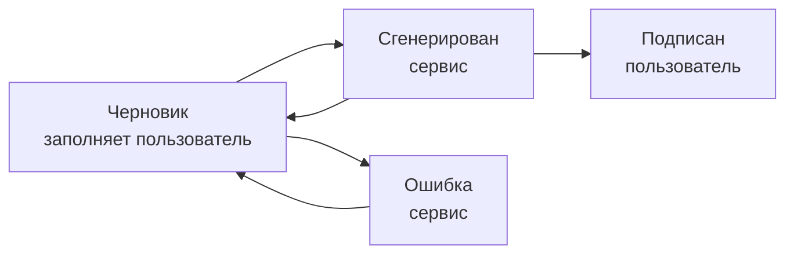
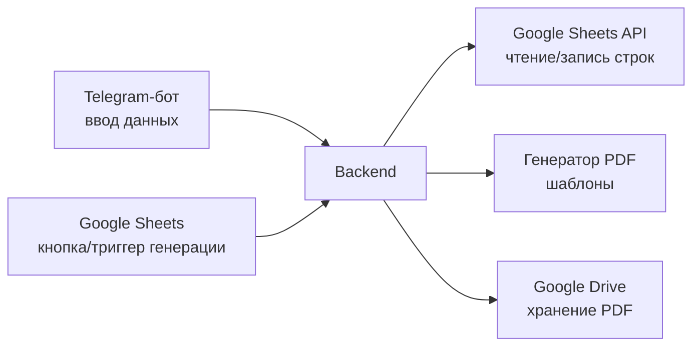

# SPEC: Сервис автоматической генерации договоров

## Назначение

Сервис генерирует договоры (PDF) на основе данных из Google Sheets. Одна строка таблицы = один договор с приложением. Сервис читает строки, подставляет данные в шаблон, сохраняет PDF и обновляет статус строки.

## Шаблоны

Два шаблона договора, выбор определяется колонкой «Маркировка»:

| Шаблон | Когда | Особенности |
|---|---|---|
| С маркировкой | `Маркировка = Да` | Разделы 3 «Маркировка рекламных материалов» и 4 «Взаимодействие с ОРД», термины ОРД/ЕРИР/Идентификатор, п.2.2 приложения (данные рекламодателя: название, ИНН, ОГРН), п.2.3 (сторона, передающая данные в ОРД), колонка «Аккаунт» в перечне услуг, упоминание проекта в п.1.1 |
| Без маркировки | `Маркировка = Нет` | Термин «Публикация» (нерекламные материалы) вместо «Рекламные материалы», без ОРД/ЕРИР, без данных рекламодателя (ИНН/ОГРН), без колонки «Аккаунт», без упоминания проекта |

## Константы (конфиг сервиса, не таблица)

Реквизиты Заказчика (ООО «Рассвет.Диджитал»): адрес, адрес для корреспонденции, ИНН, КПП, банк, р/с, к/с, БИК, подписант (Генеральный директор Ерохнович Светлана Евгеньевна, действует на основании Устава), e-mail заказчика. Весь юридический текст тел договоров.

## Таблица Google Sheets: лист «Договоры»

Одна строка = один договор. Маппинг колонок в коде — по точному тексту заголовка первой строки, не по индексу.

| Колонка | Тип | Обязательность | Примечание |
|---|---|---|---|
| Маркировка | Список: `Да` / `Нет` | Всегда | Выбор шаблона |
| Дата договора | Дата | Всегда | Основа номера договора и строки «г. Москва «25» сентября 2026 г.» |
| Номер | Текст | Всегда | Суффикс номера договора (напр. `С1`); полный номер = `ДДММГГГГ-Номер` → `25092026-С1` |
| Проект | Текст | Только с маркировкой | В немаркированном шаблоне не используется |
| Клиент (полное название) | Текст | Всегда | «действующего в интересах …» в п.1.1 приложения |
| Клиент (краткое название) | Текст | Только с маркировкой | П.2.2.1 «Рекламодатель – …» |
| ИНН клиента | Текст | Только с маркировкой | Формат ячейки «Обычный текст» |
| ОГРН клиента | Текст | Только с маркировкой | Формат ячейки «Обычный текст» |
| Канал | Текст | Всегда | Название Telegram-канала |
| Ссылка на канал | Текст (URL) | С маркировкой | В немаркированном может не использоваться |
| Дата публикации | Дата | Всегда | Полная дата с годом |
| Дата окончания размещения | Дата | Всегда | Формулой в Sheets: `=Дата публикации + Срок` (по эталонному договору: 28.09 + 30 дней → 28.10) |
| Срок размещения (дней) | Число | Всегда | |
| Стоимость | Число | Всегда | Без пробелов и ₽. Формат «29 700» и сумма прописью генерируются кодом |
| НДС | Список | Всегда | `НДС не облагается (УСН)` / `Включая НДС __%` / `НДС не облагается (НПД)` |
| Кто передаёт данные в ОРД | Список: `Заказчик` / `Исполнитель` | Только с маркировкой | П.2.3 приложения |
| Тип исполнителя | Список: `ИП` / `Самозанятый` | Всегда | Определяет блок реквизитов и допустимый НДС |
| Исполнитель (полное название) | Текст | Всегда | Преамбула договора и приложения |
| Исполнитель (кратко) | Текст | Всегда | Для подписи «___ / Стефанов А.Р.» |
| ИНН исполнителя | Текст | Всегда | |
| ОГРНИП исполнителя | Текст | Только для ИП | |
| Адрес исполнителя | Текст | Для ИП | |
| Банк исполнителя | Текст | При наличии счёта | |
| Расчётный счёт | Текст | При наличии счёта | |
| Корр. счёт | Текст | Вместе с банком | |
| БИК | Текст | Вместе с банком | |
| E-mail исполнителя | Текст | Опционально | Таблица контактов п.1.2 приложения |
| Мессенджер исполнителя | Текст | Опционально | |
| Телефон исполнителя | Текст | Опционально | |
| Статус | Список | Всегда | См. «Жизненный цикл статуса» |
| Ссылка на файл | Текст (URL) | Заполняет сервис | Ссылка на сгенерированный PDF |

Все значения списков — через Data Validation («Значение из списка»), сопоставление в коде по точной строке.

## Правила валидации

1. Набор обязательных полей зависит от «Маркировка» и «Тип исполнителя» (см. таблицу выше).
2. Связка «Тип исполнителя» → «НДС»:
   - `ИП` → `НДС не облагается (УСН)` или `Включая НДС __%`
   - `Самозанятый` → только `НДС не облагается (НПД)`; в документ добавляется обязательство исполнителя предоставить чек в день получения оплаты
3. Даты — реальные даты (формат «Дата»), не текст. Год обязателен: используется в номере договора, сроках размещения.
4. ИНН, ОГРН, ОГРНИП, счета, БИК — текст, без потери ведущих нулей.
5. «Стоимость» — число. Сервис форматирует с разделителем тысяч и генерирует сумму прописью: «29 700 (Двадцать девять тысяч семьсот) рублей 00 копеек».

## Жизненный цикл статуса

- `Черновик` — строка готова к генерации. Триггер для сервиса.
- `Сгенерирован` — сервис создал PDF, записал URL в «Ссылка на файл», сменил статус. Повторно не обрабатывается.
- `Ошибка` — валидация не пройдена. Детали (какого поля не хватает) сервис пишет в статус или отдельный комментарий, напр. `Ошибка: нет ИНН клиента`. После исправления пользователь возвращает `Черновик`.
- `Подписан` — выставляет пользователь. Сервис строку не трогает.

Правки после генерации: пользователь исправляет данные и возвращает `Черновик` → сервис перегенерирует. Политика версионирования (перезапись файла vs новая версия `_v2`) — определить при реализации; рекомендуется новая версия, чтобы разосланные ссылки не меняли содержимое.

## Архитектура

### Компоненты

### Стек: TypeScript + Bun

Один язык на бота, работу с Sheets и генерацию PDF:
- Telegram-бот: grammY (зрелый, webhook + long polling)
- Google Sheets/Drive: `googleapis`, авторизация через OAuth2 от аккаунта владельца (desktop client + refresh token; приложение в Cloud Console должно быть в статусе «Production», иначе refresh token живёт 7 дней). Все файлы и правки выполняются от имени владельца
- PDF: шаблоны — оригинальные DOCX (`templates/marked.docx`, `templates/unmarked.docx`), плейсхолдеры `{tag}` вставляются в них скриптом `tools/inject_placeholders.cjs` (node, запуск из корня репо). Подстановка — `docxtemplater` (backend) / `DocumentApp.replaceText` (Apps Script), конвертация в PDF — через Drive (экспорт Google Doc). НДС-формулировка подставляется целиком плейсхолдером `{vatClause}` (УСН / НПД+чек / НДС %). Жёлтая подсветка из шаблонов снимается при генерации

Go рассматривался как альтернатива (связка с Telegram, микросервисы), но отклонён: экосистема генерации/заполнения PDF в Go слабая (платный UniDoc либо ручная раскладка в gofpdf), а конкурентность и микросервисы на этом объёме не нужны — один сервис, один процесс.

### Telegram-бот

- `/start` — список команд + инлайн-кнопка «📄 Сформировать документ» (то же делает `/new`). Бот отвечает подсказкой формата и ждёт сообщение с данными
- Основной ввод — свободным сообщением (формат, исполнитель + реквизиты, проект, клиент, канал, дата публикации, стоимость, НДС), `src/parseMessage.ts` разбирает его в строку таблицы. Нормализация: неразрывные пробелы в числах, цена «29.700₽» → 29700, дата «28.09» → текущий год, «Общество с ограниченной ответственностью…» → краткое «ООО …», ФИО исполнителя → «Стефанов А.Р.»
- Поля, которых нет в сообщении, бот доспрашивает по одному (номер договора; ИНН/ОГРН клиента при маркировке). Дефолты: дата договора = сегодня, срок = 30 дней, ОРД = Заказчик
- Если ИНН/ОГРН клиента отсутствуют — автопоиск в ЕГРЮЛ (`src/companyLookup.ts`, egrul.nalog.ru, без ключа): ровно 1 релевантный результат → подставляется автоматически; несколько → выбор кнопками; не найдено → доспрос. Релевантность — по значимому токену названия (текст в кавычках или самое длинное слово)
- После сбора всех полей — **превью** с кнопками: «✅ Сгенерировать», «✏️ Исправить» (список полей кнопками → ввод нового значения → назад к превью), «❌ Отмена». Кнопка отмены висит на каждом шаге ввода, `/cancel` работает всегда. По «Сгенерировать»: запись строки в таблицу → генерация PDF → обновление строки (статус «Сгенерирован» + ссылка) → ссылка в чат. При ошибке генерации строка остаётся с текстом ошибки в «Статус», доступна `/generate <строка>`
- Авторизация отключена (временно, функционал доступен всем). Закомментированный вариант: белый список Telegram user ID (`TELEGRAM_ALLOWED_IDS` в конфиге + middleware в `createBot`)

### Кнопка генерации в таблице

В Google Sheets нет нативных кнопок в ячейках, поэтому генерация запускается из меню. Реализовано в `apps-script/Code.gs` (автономно, без backend'а):

- Меню «Договоры → Сгенерировать для текущей строки» (появляется через `onOpen`)
- Скрипт читает активную строку, валидирует (правила — как в «Правилах валидации»), копирует Google Doc-шаблон (с маркировкой / без — по колонке «Маркировка»), подставляет плейсхолдеры через `DocumentApp.replaceText`, экспортирует PDF в папку Drive, пишет «Статус» и «Ссылка на файл»
- Шаблоны для Apps Script — **Google Docs** (конвертированы из `templates/*.docx`), их ID — в `CONFIG` в начале `Code.gs`
- Ошибки валидации пишутся в «Статус» как `Ошибка: …`

Backend (Telegram-бот, `POST /generate`) — опциональный следующий шаг для запуска вне таблицы. Логика валидации и подстановки продублирована (`src/contractData.ts` ↔ `Code.gs`); при изменении правил править обе копии.

### API backend'а (минимум)

- `POST /generate` — `{ spreadsheetId, sheet, row }` → валидация → генерация → загрузка на Drive → обновление «Статус» и «Ссылка на файл»
- `POST /telegram/webhook` — апдейты бота
- `GET /health`

## Открытые вопросы

1. Точный набор полей блока реквизитов самозанятого в разделе «Адреса и реквизиты сторон» (нужен заполненный пример договора с самозанятым).
2. Используется ли «Ссылка на канал» в немаркированном шаблоне.
3. Политика версионирования файлов при перегенерации.
